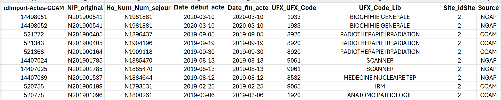
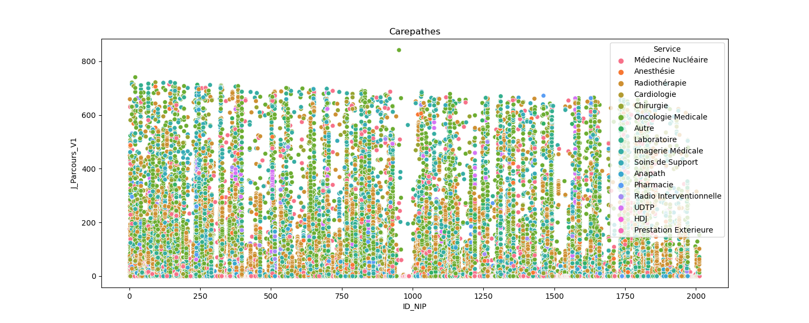
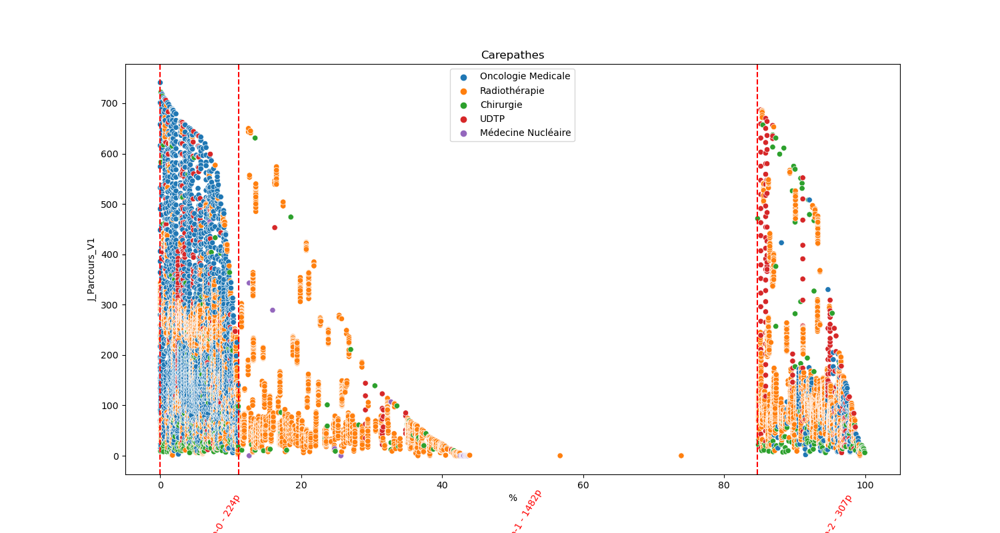
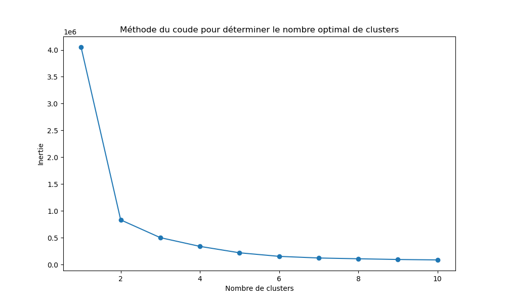
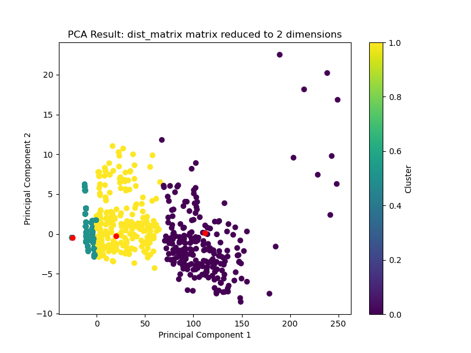

# ML-ICO-Activity

  From administraive hospital logs, try to cluster patient carepathes and predict global activity of services of hospital.

# Table of contents

- [Usage](#usage)
- [Installation](#installation)
- [Support](#Support)
- [Project status](#Project-status)
- [License](#license)

# Usage

[(Back to top)](#table-of-contents)

From a log of activity, stored in a SQL Database.
0. Read a configuration file with parameters of the study
1. Perform some data pretreatment in TSQL, filters,etc..
2. Extract a dataset from the Database
3. Run a aggregation query in TSQL to transform the log (1 line = 1 activity of a patient into a TimeserieTable : 1 line= 1 patient Time serie activity)
4. Compute distance between several patients, by using DTW package (Giorgino. Computing and Visualizing Dynamic Time Warping Alignments).
5. Perform a clustering
6. Store result into mlflow.

Input data :

By using several UFX as carepathes dimensions, I do a clustering is based on the shape of the activity of several dimensions.
Then we obtain several categories of patients based on their Activity.

To improve the understanding of the clustering I did a custom data Visualization of the data.
First transform the log table into "carepathes" lines to see among a life-line what happend to the patient, then plot it on a graph.

Unclustered data :

Clustered carepathes :

From this clustering analysis, three main groups can be distinguished:

- Group 1: Patients who appear to undergo a complete care path within the hospital, with one wave of radiotherapy treatment.
- Group 2 and 5: Patients with minimal activity in the hospital, possibly related to inter-establishment procedures, and individuals without complex illnesses.
- Group 3 and 4: Patients who appear to undergo a comprehensive care path within the hospital, involving two waves of radiotherapy treatment and an initial surgery.

# Installation

[(Back to top)](#table-of-contents)
  
  Please refer to requirements.txt to configure your environement.

# Project status

[(Back to top)](#table-of-contents)

    In progress, trying to improve the clustering, by adding new datafeature into the logfile, and use other methods of clustering
	
	
	
# License

[(Back to top)](#table-of-contents)
	
